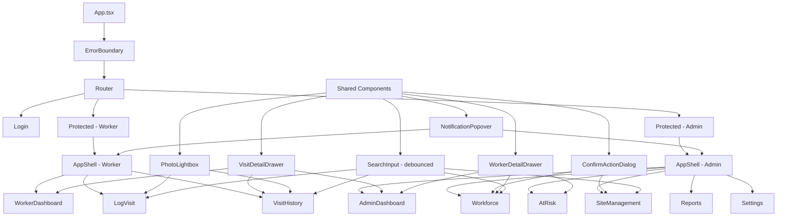

# Field Force Tracker — Production Readiness Plan

## Overview

This document details every interactive element that needs wiring up across the Field Force Tracker prototype to make it production-ready. Each section identifies the current gap, the proposed solution, and the specific files/components affected.

---

## 1. Login Page (`src/pages/Login.tsx`)

### 1.1 "Forgot?" Button — Dead Link
- **Current:** `<button type="button" className="...">Forgot?</button>` does nothing on click
- **Fix:** Wire to a `ForgotPasswordDialog` using the existing `Dialog` component from `@/components/ui/dialog`. Show a form with email input that displays a confirmation message on submit. Since this is client-only, store a toast: "Password reset link sent (demo)".

### 1.2 Form Validation & Error Feedback
- **Current:** No validation error messages shown inline; login silently fails for unknown emails
- **Fix:** 
  - Add `useState` for `error` string
  - If email doesn't match any worker or admin, show inline error: "No account found for this email"
  - Add email format validation before submit
  - Show error state on the input (red border + error text)

### 1.3 Password Field
- **Current:** Password is accepted but never validated (any value works)
- **Fix:** For demo mode, this is acceptable, but add a comment/indicator that auth is demo-only. For production scaffold, add a `validateCredentials()` function that can be swapped out later.

---

## 2. AppShell (`src/components/AppShell.tsx`)

### 2.1 Notification Bell — No Dropdown
- **Current:** `<button>` with `Bell` icon and red dot indicator does nothing
- **Fix:** Wire to a `NotificationPopover` using `Popover` from `@/components/ui/popover`. Content:
  - List recent at-risk worker alerts (derived from store data)
  - "View All" link to `/admin/at-risk` (admin) or no-op (worker)
  - Mark-as-read functionality (local state only)
  - Badge count from flagged workers count

### 2.2 Mobile Hamburger Menu
- **Current:** No hamburger menu on mobile; only bottom nav with 3 items + logout
- **Fix:** Add a `Sheet` component from `@/components/ui/sheet` triggered by a `Menu` icon in the topbar (mobile only). Sheet contains the full nav list (all admin/worker nav items), user profile section, and logout button. This is critical for admin users who have 6 nav items but only 3 show in the bottom nav.

### 2.3 Mobile Bottom Nav — Admin Gets 6 Items Truncated to 3
- **Current:** `items.slice(0, 3)` means admin loses access to Reports, Sites, Settings on mobile
- **Fix:** With the hamburger menu (2.2), the bottom nav can stay at 3 items. The 4th slot remains "Sign Out". Add a "More" button as the 4th slot that opens the Sheet menu, replacing the direct "Sign Out" button. Move Sign Out into the Sheet.

---

## 3. Worker Dashboard (`src/pages/worker/WorkerDashboard.tsx`)

### 3.1 Visit Items — Not Clickable
- **Current:** Recent activity items are static `
` elements
- **Fix:** Make each visit item a clickable element that opens a `VisitDetailDrawer` using `Drawer` from `@/components/ui/drawer`. Shows:
  - Full visit details (site name, address, time, km, inspection type, notes)
  - Photo gallery if photos exist
  - "Edit" and "Delete" actions (delete with confirmation)

### 3.2 KPI Rings — Not Interactive
- **Current:** KPI rings are display-only
- **Fix:** Add hover tooltip explaining the metric calculation. Click could navigate to Visit History with a filter pre-applied.

### 3.3 Auto-Refresh / Live KPI
- **Current:** KPIs are static after page load
- **Fix:** Add a `useEffect` with `setInterval` (every 60s) that force-renders KPI data. Add a small "Last updated: XX:XX" timestamp and a manual refresh button.

---

## 4. Log Visit (`src/pages/worker/LogVisit.tsx`)

### 4.1 Form Validation UX
- **Current:** Validation only happens on submit with `toast.error()`
- **Fix:** Add inline validation:
  - Red border + helper text on fields that fail validation
  - Real-time validation as user types (after first blur)
  - Disable submit button until all required fields are filled
  - Character count on notes field

### 4.2 Site Search — No Debouncing
- **Current:** `query` state filters on every keystroke
- **Fix:** Add `useDeferredValue` or a custom `useDebouncedValue` hook to debounce the search input. This prevents excessive re-renders with large site lists.

### 4.3 Photo Capture — Camera Not Available on Desktop
- **Current:** `capture="environment"` may not work on desktop browsers
- **Fix:** Graceful fallback — if camera isn't available, hide the "Take photo" button and only show "Upload". Detect with `navigator.mediaDevices` check.

### 4.4 Submit Loading State
- **Current:** No loading indicator during submission
- **Fix:** Add `isSubmitting` state. Disable the submit button and show a spinner during submission. Even though the store action is synchronous, this establishes the pattern for when a real API is added.

### 4.5 Form Reset After Navigation
- **Current:** If user navigates back and forward, form state persists (React state is lost on unmount, but if they use browser back it may be unexpected)
- **Fix:** Reset form state on mount using a `useEffect` cleanup. This ensures a clean form every time.

---

## 5. Visit History (`src/pages/worker/VisitHistory.tsx`)

### 5.1 No Search/Filter
- **Current:** Shows all visits grouped by date with no way to filter
- **Fix:** Add:
  - Search input (filter by site name or inspection type)
  - Date range picker using `Calendar` from `@/components/ui/calendar` in a `Popover`
  - Inspection type filter dropdown

### 5.2 No Pagination
- **Current:** `Object.entries(groups).slice(0, 30)` hard-caps at 30 days
- **Fix:** Add "Load more" button or infinite scroll. Show a count of total visits and how many are currently displayed.

### 5.3 Visit Items — Not Clickable
- **Current:** Visit entries are static display
- **Fix:** Same as 3.1 — make clickable to open `VisitDetailDrawer`

### 5.4 Photo Thumbnails — Open in New Tab
- **Current:** Photos open as base64 data URLs in a new tab
- **Fix:** Open photos in a lightbox/modal dialog within the app using `Dialog` component. Add prev/next navigation between photos in the same visit.

---

## 6. Admin Dashboard (`src/pages/admin/AdminDashboard.tsx`)

### 6.1 Flagged Worker Rows — Link to At-Risk but Not to Specific Worker
- **Current:** Flagged worker rows link to `/admin/at-risk` generically
- **Fix:** Either:
  - Link to `/admin/at-risk?worker={id}` and auto-scroll/highlight that worker
  - Or open a worker detail drawer directly from the dashboard

### 6.2 Real-time Activity — Not Interactive
- **Current:** Activity feed items are static
- **Fix:** Make each activity item clickable to show visit details in a drawer/dialog.

### 6.3 Notification Bell (see 2.1)
- The notification popover should show the same flagged worker data as the dashboard, but in a compact format.

### 6.4 Auto-Refresh
- **Current:** Dashboard data is static after page load
- **Fix:** Same as 3.3 — add periodic refresh with timestamp indicator.

---

## 7. Workforce Page (`src/pages/admin/Workforce.tsx`)

### 7.1 No Edit Worker Functionality
- **Current:** Only "Remove" action exists; no way to edit worker details
- **Fix:** Add "Edit" button per row that opens an `EditWorkerDialog` (reuse the same form layout as the Add Worker modal). Pre-populate fields with current worker data. Call `updateWorker()` on save.

### 7.2 Remove Worker — No Confirmation
- **Current:** `onClick={() => { removeWorker(w.id); toast.success("Worker removed"); }}` — instant deletion with no confirmation
- **Fix:** Replace with `AlertDialog` from `@/components/ui/alert-dialog`. Show: "Are you sure you want to remove {name}? This action cannot be undone." Only proceed on confirm.

### 7.3 Search — No Debouncing
- **Current:** Search input filters on every keystroke
- **Fix:** Same as 4.2 — add debouncing.

### 7.4 Period Toggle — Works But Could Be Smoother
- **Current:** Period toggle (day/week/month) works but causes a full re-render
- **Fix:** Add transition animation when switching periods. Consider `useTransition` for non-blocking updates.

### 7.5 Add Worker Modal — Uses Custom Overlay Instead of Dialog Component
- **Current:** Custom `fixed inset-0` overlay div
- **Fix:** Replace with `Dialog` from `@/components/ui/dialog` for consistency, accessibility (focus trap, escape key), and animation.

---

## 8. At-Risk Workers (`src/pages/admin/AtRisk.tsx`)

### 8.1 No Intervention Actions
- **Current:** Cards are display-only with no actions
- **Fix:** Add action buttons per worker card:
  - "Send Reminder" — toast: "Reminder sent to {name} (demo)"
  - "Reassign Sites" — opens a dialog showing worker's sites with reassignment options
  - "View Full Profile" — opens worker detail drawer
  - "Escalate" — changes a visual flag, toast: "Escalated to management (demo)"

### 8.2 No Period Toggle
- **Current:** Shows daily, weekly, and monthly data simultaneously
- **Fix:** This is actually good UX. Keep as-is but make the period boxes clickable to expand with more detail.

### 8.3 Cards Not Expandable
- **Current:** All info is shown at once in a compact card
- **Fix:** Add expandable section using `Collapsible` from `@/components/ui/collapsible`. Show basic info by default; expand to see visit history, recent sites, and trend chart.

---

## 9. Site Management (`src/pages/admin/SiteManagement.tsx`)

### 9.1 No Edit Site Functionality
- **Current:** Can only toggle active/inactive and remove sites
- **Fix:** Add "Edit" button per site card that opens an `EditSiteDialog`. Pre-populate with current site data. Call `updateSite()` on save.

### 9.2 Remove Site — No Confirmation
- **Current:** Instant deletion with no confirmation
- **Fix:** Same as 7.2 — use `AlertDialog` for confirmation.

### 9.3 No Search/Filter
- **Current:** All sites shown with no filtering
- **Fix:** Add search input (filter by name, address, zone) and zone filter dropdown.

### 9.4 Active/Inactive Toggle — No Confirmation for Deactivation
- **Current:** Single click toggles active state
- **Fix:** For deactivation only, show a confirmation: "Deactivating this site will prevent workers from logging visits here. Continue?" Activation can be instant.

### 9.5 Add Site Modal — Uses Custom Overlay
- **Current:** Same custom overlay pattern as Workforce
- **Fix:** Replace with `Dialog` component for consistency and accessibility.

---

## 10. Reports & Analytics (`src/pages/admin/Reports.tsx`)

### 10.1 Charts — No Click Interaction
- **Current:** Recharts are display-only
- **Fix:** Add `onClick` handlers to chart elements:
  - Area chart: Click a data point to see day detail in a dialog
  - Bar chart: Click a worker bar to navigate to their workforce detail
  - Pie chart: Click a site slice to navigate to site management

### 10.2 No Export/Download
- **Current:** No way to export report data
- **Fix:** Add "Export CSV" button that generates a CSV from the current filtered data and triggers a download. Use `Blob` + `URL.createObjectURL` pattern.

### 10.3 Period Toggle Works But Could Show Date Range
- **Current:** Period buttons (7d/30d/90d) work but don't show the actual date range
- **Fix:** Show the date range below the toggle: "Apr 1 — Apr 30, 2026"

---

## 11. Settings (`src/pages/admin/Settings.tsx`)

### 11.1 Per-Worker KM Target — Saves on Every Keystroke
- **Current:** `onChange={e => updateWorker(w.id, { dailyKmTarget: +e.target.value || 0 })}` — immediate save on every character typed
- **Fix:** Add local state per worker with a "Save" button (or debounce with auto-save indicator). Only call `updateWorker()` when the user explicitly saves or after a debounce period.

### 11.2 No Validation
- **Current:** Any number (including 0 or negative) is accepted
- **Fix:** Add min/max validation (e.g., min 10, max 200 km). Show inline error for invalid values.

### 11.3 No Reset to Defaults
- **Current:** No way to reset targets to defaults
- **Fix:** Add "Reset to Defaults" button that restores `DEFAULT_DAILY_VISITS` and `DEFAULT_DAILY_KM` from mock-data.

### 11.4 Global Target — No Unsaved Changes Warning
- **Current:** Global target has an explicit Save button (good), but no indication of unsaved changes
- **Fix:** Disable Save button when value equals current target. Show "Unsaved changes" indicator when modified.

---

## 12. Global Improvements

### 12.1 Confirmation Dialogs for Destructive Actions
- **Affected:** Workforce (remove worker), SiteManagement (remove site, deactivate site)
- **Fix:** Create a reusable `ConfirmActionDialog` component wrapping `AlertDialog`. Props: `title`, `description`, `confirmLabel`, `variant` (destructive/normal), `onConfirm`.

### 12.2 Loading/Skeleton States
- **Current:** No loading states anywhere — data appears instantly (because it's mock)
- **Fix:** Add skeleton loaders using `Skeleton` from `@/components/ui/skeleton`:
  - Dashboard cards: show skeleton for 500ms on first load
  - Tables: show skeleton rows
  - Charts: show skeleton chart area
  - Create a `useLoadingState` hook that simulates a minimum loading time

### 12.3 Error Boundaries
- **Current:** No error boundaries — a runtime error crashes the entire app
- **Fix:** Add a React Error Boundary component at the App level and at each page level. Show a friendly error UI with "Try Again" button.

### 12.4 Keyboard Navigation & Accessibility
- **Current:** Many interactive elements are `
` or `<button>` without proper ARIA
- **Fix:**
  - Add `role="button"` and `tabIndex={0}` with `onKeyDown` for Enter/Space on clickable divs
  - Add `aria-label` to icon-only buttons
  - Ensure all modals/drawers trap focus properly (Radix components handle this)
  - Add skip-to-content link for keyboard users

### 12.5 Toast Consistency
- **Current:** Some actions use `toast.success()`, some use `toast.error()`, inconsistent descriptions
- **Fix:** Standardize toast patterns:
  - Success: `toast.success("{Entity} {action}", { description: "{details}" })`
  - Error: `toast.error("Failed to {action}", { description: "{reason}" })`
  - Loading: `toast.loading("{Action}ing...")` with `toast.dismiss()` on complete

### 12.6 Optimistic Updates
- **Current:** Store updates are synchronous (Zustand), so this works implicitly
- **Fix:** When moving to async APIs, wrap store actions with optimistic update pattern. For now, add a brief artificial delay (200ms) on mutations to show the loading state and establish the pattern.

---

## Architecture Diagram

## New Shared Components to Create

| Component | Based On | Used In |
|-----------|----------|---------|
| `ConfirmActionDialog` | `AlertDialog` | Workforce, SiteManagement |
| `VisitDetailDrawer` | `Drawer` | WorkerDashboard, VisitHistory, AdminDashboard |
| `NotificationPopover` | `Popover` | AppShell |
| `WorkerDetailDrawer` | `Drawer` | AdminDashboard, Workforce, AtRisk |
| `PhotoLightbox` | `Dialog` | VisitHistory, VisitDetailDrawer |
| `DebouncedSearchInput` | `Input` | LogVisit, VisitHistory, Workforce, SiteManagement |
| `MobileNavSheet` | `Sheet` | AppShell |
| `ErrorBoundary` | React.Component | App.tsx |
| `PageSkeleton` | `Skeleton` | All pages |

## File Change Summary

| File | Changes |
|------|---------|
| `src/pages/Login.tsx` | Forgot password dialog, inline validation, error states |
| `src/components/AppShell.tsx` | Notification popover, mobile sheet nav, more button in bottom nav |
| `src/pages/worker/WorkerDashboard.tsx` | Clickable visits, auto-refresh, KPI tooltips |
| `src/pages/worker/LogVisit.tsx` | Inline validation, debounced search, loading state, camera detection |
| `src/pages/worker/VisitHistory.tsx` | Search/filter, date picker, pagination, visit detail drawer, photo lightbox |
| `src/pages/admin/AdminDashboard.tsx` | Clickable worker rows, clickable activity items, auto-refresh |
| `src/pages/admin/Workforce.tsx` | Edit worker dialog, confirmation dialog, debounced search, Dialog component |
| `src/pages/admin/AtRisk.tsx` | Intervention actions, expandable cards |
| `src/pages/admin/SiteManagement.tsx` | Edit site dialog, confirmation dialog, search/filter, Dialog component |
| `src/pages/admin/Reports.tsx` | Chart click handlers, CSV export, date range display |
| `src/pages/admin/Settings.tsx` | Debounced KM targets, validation, reset to defaults, unsaved changes indicator |
| `src/App.tsx` | Error boundary wrapper |
| `src/lib/store.ts` | Add `removeVisit()`, `updateVisit()` actions |

## New Files to Create

| File | Purpose |
|------|---------|
| `src/components/ConfirmActionDialog.tsx` | Reusable destructive action confirmation |
| `src/components/VisitDetailDrawer.tsx` | Visit detail with photos and actions |
| `src/components/NotificationPopover.tsx` | Bell icon dropdown with alerts |
| `src/components/WorkerDetailDrawer.tsx` | Worker profile with KPIs and actions |
| `src/components/PhotoLightbox.tsx` | Full-screen photo viewer with navigation |
| `src/components/DebouncedSearchInput.tsx` | Search input with debounce |
| `src/components/MobileNavSheet.tsx` | Mobile hamburger menu |
| `src/components/ErrorBoundary.tsx` | React error boundary |
| `src/components/PageSkeleton.tsx` | Page-level loading skeleton |
| `src/hooks/use-debounce.ts` | Debounce hook for search inputs |
